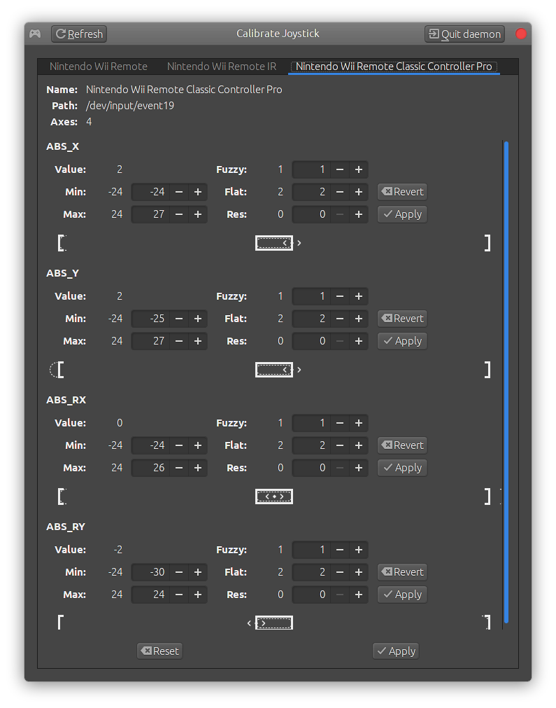

# calibrate-joystick - a tool to calibrate joysticks on Linux systems

This is a graphical program to quickly calibrate range and deadzones of joysticks.

## Usage

  - Run the program.

  - On the application window, select the desired input device.

  - Move the sticks to their maximum range. This will be detected as the new minimum and
    maximum ranges.
  
  - If needed, manually adjust the **Flat** parameter; that is the *dead zone*.
  
  - Click **Apply**.

  - Customization of joysticks is not permanent; it's lost when the device is unplugged,
    or when the system reboots.

Note: input devices are enumerated through udev. Only devices with the property
`ID_INPUT_JOYSTICK=1` are processed. If your joystick isn't shown, use this command to
inspect it:

    udevadm info /dev/input/eventN

where `eventN` is the desired device. Udev uses heuristics to guess which devices are
joysticks, but this can be overridden with udev rules.

Note: for security reasons, udev only allows users direct access to devices with the
`uaccess` tag. If your device was not tagged with `uaccess`, either create a custom udev
rule to tag it with `uaccess`, or run calibrate-joystick with sudo/root permissions.

The program can also be run as a daemon:

    calibrate-joystick -d

The main window will stay hidden until an input device is inserted. Closing the window
won't stop the daemon, it must be explicitly closed through the **Quit daemon** button.

## Dependencies

This program requires a C++20 compiler. Additionally, it uses the following libraries:

- [gtkmm-3.0](http://gtkmm.org): usually available as a package in your distro (you need
  the "devel" package.)

- [libevdev](http://www.freedesktop.org/wiki/Software/libevdev): usually available as a
  package in your distro (you need the "devel" package.)

- [libgudev](http://wiki.gnome.org/Projects/libgudev): usually available as a package in
  your distro (you need the "devel" package.)

## Build instructions

If cloning the repository, make sure to enable submodules:

- with Mercurial:
  - `hg clone https://github.com/dkosmari/calibrate-joystick.git`

- with git:
  - `git clone --recurse-submodules --shallow-submodules https://github.com/dkosmari/calibrate-joystick.git`

If you downloaded a release tarball, you can skip step 0. 

0. `./bootstrap`
1. `./configure`
2. `make`
3. `sudo make install`

This software uses Automake, so the standard Automake build options apply. Check the
[INSTALL](INSTALL) file and the `./configure --help` command for more details.
