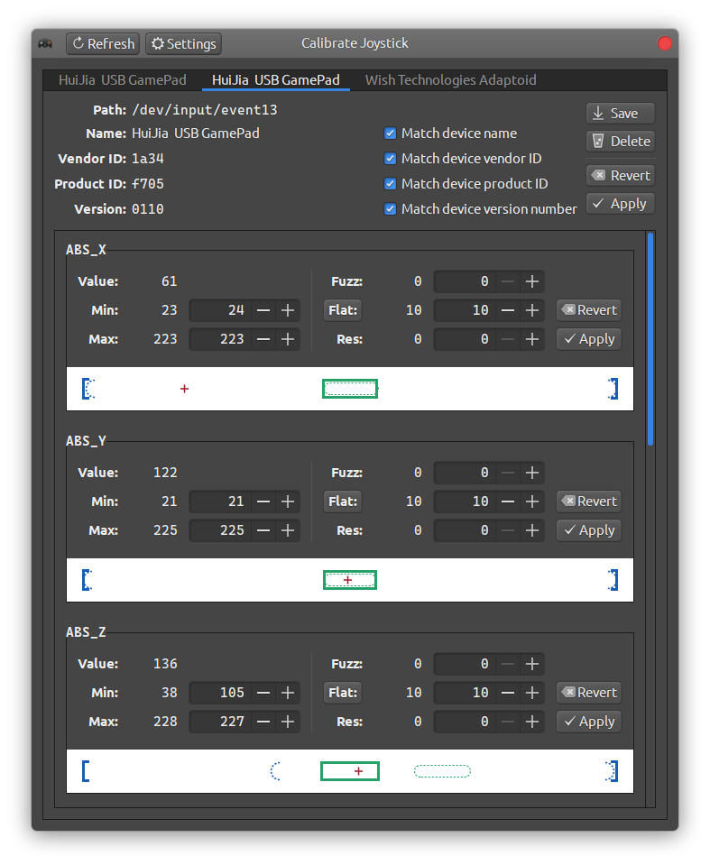

# Calibrate Joystick - a tool to calibrate joysticks on Linux systems

This is a graphical program to quickly calibrate range and deadzones of joysticks.

## Usage

  - Run the program.

  - On the application window, select the tab up top, for the desired input device.

  - Move the sticks to their extreme positions, press the analog triggers all the way and
    release. The application will detect the minimum and maximum values.

  - If needed, manually adjust the **Flat** parameter; that is the *dead zone*. You can
    change how the **Flat** region is displayed (around zero, or centered in the min-max
    range) by clicking on the **Flat** button.

  - Click **Apply** on the top to apply the calibration to all axes. Or you can use the
    **Apply** for each axis individually.

  - Optional: click **Save** to permanently store this calibration to
    `~/.config/calibrate-joysticks/db/`. Only the values that were actually applied to the
    device will be saved. Whenever you insert that same device again, the saved
    calibration will be applied.

> Note: input devices are enumerated through udev. Only devices with the property
> `ID_INPUT_JOYSTICK=1` are processed. If your joystick isn't shown, use this command to
> inspect it:
>
>    udevadm info /dev/input/eventN
>
> where `eventN` is the desired device. Udev uses heuristics to guess which devices are
> joysticks, but this can be overridden with udev rules.
>
> For security reasons, udev only allows users direct access to devices with the `uaccess`
> tag. If your device was not tagged with `uaccess`, either create a custom udev rule to
> tag it with `uaccess`, or run `calibrate-joystick` with sudo/root permissions.

The program can also be run as a daemon:

    calibrate-joystick -d

The main window will stay hidden until an input device is inserted. Closing the window
won't stop the daemon, it must be explicitly closed through the **Quit daemon** button.

## Building

### Dependencies

- A C++20 compiler. This is often installed through a meta package (or package group) like
  `task-c++-devel`, `build-essential` or `c-development` in your package manager.

  Some distros also need manual installation of C development tools like:
    - `autoconf`
    - `automake`
    - `autopoint`
    - `intltool`
    - `libtool`
    - `pkg-config`

- [gtkmm-3.0](http://gtkmm.org): usually available as a package in your distro (you need
  the "dev" or "devel" package.)

- [libevdev](http://www.freedesktop.org/wiki/Software/libevdev): usually available as a
  package in your distro (you need the "dev" or "devel" package.)

- [libgudev](http://wiki.gnome.org/Projects/libgudev): usually available as a package in
  your distro (you need the "dev" or "devel" package.)

### Instructions

If cloning the repository, make sure to enable submodules:

- with Mercurial:
  - `hg clone https://github.com/dkosmari/calibrate-joystick.git`

- with git:
  - `git clone --recurse-submodules --shallow-submodules https://github.com/dkosmari/calibrate-joystick.git`

If you downloaded a release tarball, you can skip step 0.

0. `./bootstrap`
1. `./configure`
2. `make`
3. (Optional) `sudo make install`

This software uses Automake, so the standard Automake build options apply. Check the
[INSTALL](INSTALL) file and the `./configure --help` command for more details.

To run without installing, use either:

- `make run` 
- `make run-daemon`

Note that installation is necessary for languages and desktop notifications to work.

To uninstall, run:

- `sudo make uninstall`
